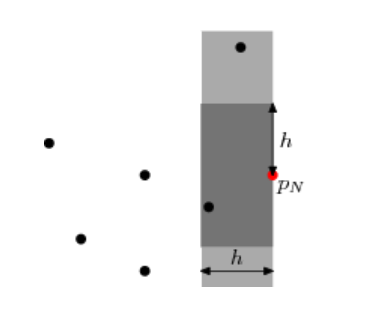
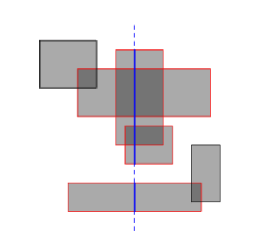

# Sweep Line Algorithm
<<<<<<< HEAD

=======
**Sweep Line**:  A vertical line that is conceptually 'swept' across the plane.

### Closest Pair
Given a set of points, find the pair that is closest (with either metric). Of course, this can be solved in O(N2) time by considering all the pairs, but a line sweep can reduce this to O(N log N).

Suppose that we have processed points 1 to N - 1 (ordered by X) and the shortest distance we have found so far is h. We now process point N and try to find a point closer to it than h. We maintain a set of all already-processed points whose X coordinates are within h of point N, as shown in the light grey rectangle. As each point is processed, it is added to the set, and when we move on to the next point or when h is decreased, points are removed from the set. The set is ordered by y coordinate. A balanced binary tree is suitable for this, and accounts for the log N factor.

To search for points closer than h to point N, we need only consider points in the active set, and furthermore we need only consider points whose y coordinates are in the range yN - h to yN + h (those in the dark grey rectangle). This range can be extracted from the sorted set in O(log N) time, but more importantly the number of elements is O(1) (the exact maximum will depend on the metric used), because the separation between any two points in the set is at least h. It follows that the search for each point requires O(log N) time, giving a total of O(N log N).

### Area of the union of rectangles
Given a set of axis-aligned rectangles, what is the area of their union? Like the line-intersection problem, we can handle this by dealing with events and active sets. Each rectangle has two events: left edge and right edge. When we cross the left edge, the rectangle is added to the active set. When we cross the right edge, it is removed from the active set.

We now know which rectangles are cut by the sweep line (red in the diagram), but we actually want to know the length of sweep line that is cut (the total length of the solid blue segments). Multiplying this length by the horizontal distance between events gives the area swept out between those two events.

We can determine the cut length by running the same algorithm in an inner loop, but rotated 90 degrees. Ignore the inactive rectangles, and consider a horizontal sweep line that moves top-down. The events are now the horizontal edges of the active rectangles, and every time we cross one, we can simply increment or decrement a counter that says how many rectangles overlap at the current point. The cut length increases as long as the counter is non-zero. Of course, we do not increase it continuously, but rather while moving from one event to the next.

With the right data structures, this can be implemented in O(N2) time (hint: use a boolean array to store the active set rather than a balanced binary tree, and pre-sort the entire set of horizontal edges). In fact the inner line sweep can be replaced by some clever binary tree manipulation to reduce the overall time to O(N log N), but that is more a problem in data structures than in geometry, and is left as an exercise for the reader. The algorithm can also be adapted to answer similar questions, such as the total perimeter length of the union or the maximum number of rectangles that overlap at any point.
>>>>>>> e63e605de79c39a6d5b2e537788fefed64b431bd
