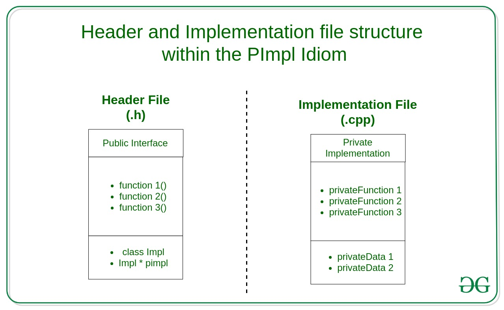

# PImple Idiom 

## Motivation
When changes are made to a header file, all sources including it needs to be recompiled. In large projects and libraries, it can cause build time issues due to the fact that even when a small change to the implementation is made everyone has to wait sometime until they compile their code.

## Pointer to Implementation
Hides the implementation in the headers and includes an interface file which compiles instantly.

The PImpl Idiom (Pointer to IMPLementation) is a technique used for separating implementation from the interface. It minimizes header exposure and helps programmers to reduce build dependencies by moving the private data members in a separate class and accessing them through an [opaque pointer](https://www.geeksforgeeks.org/opaque-pointer/).

The following picture shows the implementation:


## Implementation
1. Create a separate class for implementation.
2. Put all private members from the header to that class.
3. Define an implementation class (Impl) in the header file.
4. In the header file create a forward declaration (**a pointer**), pointing at the implementation class.
5. Define a destructor and a **copy / assignment** operators.

The reason to declare explicitly a destructor is that when compiling, the smart pointer (`std::unique_ptr`) checks if in the definition of the type exists a visible destructor and throws a compilation error if it’s only forward declared.
Using a smart pointer is a better approach since the pointer takes control over the life cycle of the PImpl.

## Example
Header file:
```cpp
/* |INTERFACE| User.h file */

#pragma once 
#include <memory> // PImpl 
#include <string> 
using namespace std; 

class User { 
public: 
	// Constructor and Destructors 
	User(string name); 
	~User(); 

	// Asssignment Operator and Copy Constructor 
	User(const User& other); 
	User& operator=(User rhs); 

	// Getter 
	int getSalary(); 

	// Setter 
	void setSalary(int); 

private: 
	// Internal implementation class 
	class Impl; 

	// Pointer to the internal implementation 
	unique_ptr<Impl> pimpl; 
}; 
```

Implementation:
```cpp
/* |IMPLEMENTATION| User.cpp file */

#include "User.h" 
#include <iostream> 
using namespace std; 

class User::Impl { 
	Impl(string name) : name(name){}; 
	~Impl(); 

	void welcomeMessage() { 
		cout << "Welcome, " << name << endl; 
	} 
	string name; 
	int salary = -1; 
}; 

// Constructor connected with our Impl structure 
User::User(string name) : pimpl(new Impl(name)) { 
	pimpl->welcomeMessage(); 
} 

// Default Constructor 
User::~User() = default; 

// Assignment operator and Copy constructor 
User::User(const User& other) : pimpl(new Impl(*other.pimpl)) { } 

User& User::operator=(User rhs) { 
	swap(pimpl, rhs.pimpl); 
	return *this; 
} 

// Getter and setter 
int User::getSalary() { 
	return pimpl->salary; 
} 

void User::setSalary(int salary) { 
	pimpl->salary = salary; 
	cout << "Salary set to "
		<< salary << endl; 
} 
```
